# 🎓 E-Learning Platform

A full-stack e-learning platform built using **React.js, Node.js, Express.js, and MongoDB**.

The platform allows users to browse courses, explore chapters, purchase courses, manage their learning content, and maintain their profiles. Administrators can manage users, courses, categories, authors, and chapters through the admin dashboard.

---

## 🌐 Live Demo

🚀 **[Visit E-Learning Platform](https://e-learning-platform-1-gck5.onrender.com/)**

> **Note:** The application is hosted on Render's free tier, so the first request may take some time if the service has been inactive.

---

## ✨ Features

### 👤 User Features

- User registration and login
- Browse available courses
- Search and filter courses
- View course details
- Explore course chapters
- Purchase courses
- Access purchased learning content
- User profile management
- Wishlist management
- Shopping cart
- Payment history


### 🔐 Security

- Environment-based configuration
- Protected API routes
- Role-based access control
- Secure database connection
- CORS configuration
- JWT-based authentication

---

## 🛠️ Tech Stack

### Frontend

- React.js
- JavaScript
- HTML5
- CSS3
- Bootstrap
- React Router

### Backend

- Node.js
- Express.js
- REST API
- JWT Authentication

### Database

- MongoDB
- Mongoose
- MongoDB Atlas

### Deployment

- Frontend: Render
- Backend: Render
- Database: MongoDB Atlas

---

## 📸 Screenshots

### 🏠 User Interface

<table>
  <tr>
    <td>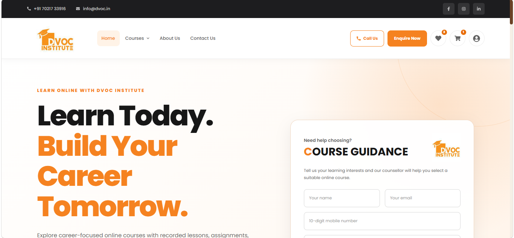</td>
    <td>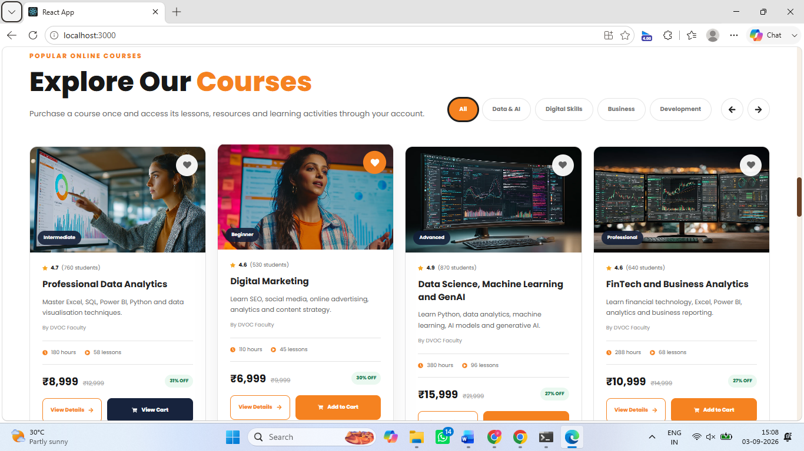</td>
  </tr>
  <tr>
    <td>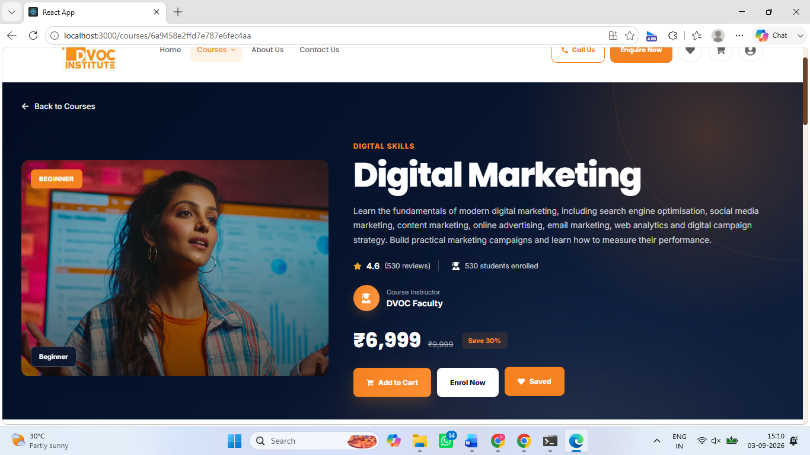</td>
    <td>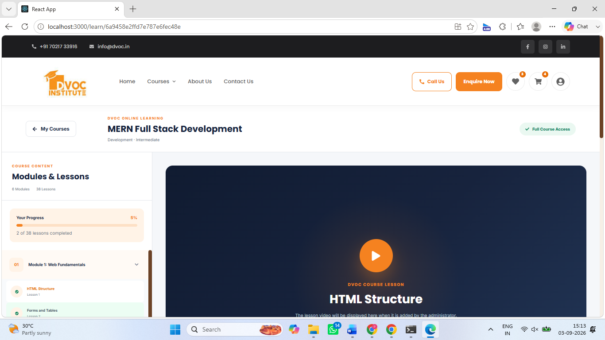</td>
  </tr>
</table>

### 👤 User Account

<table>
  <tr>
    <td>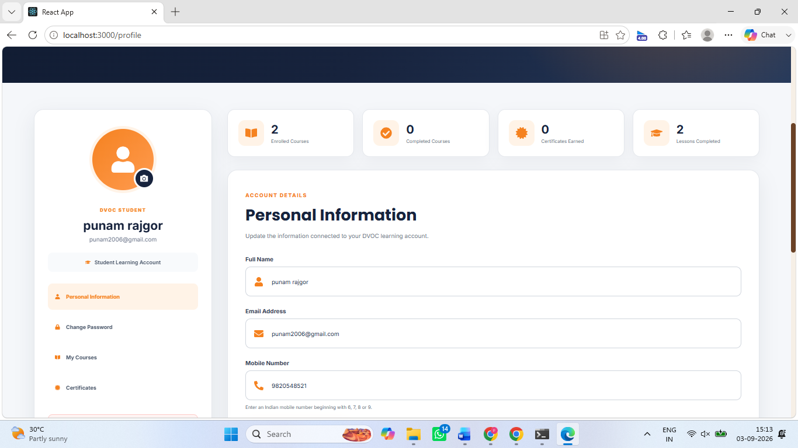</td>
    <td>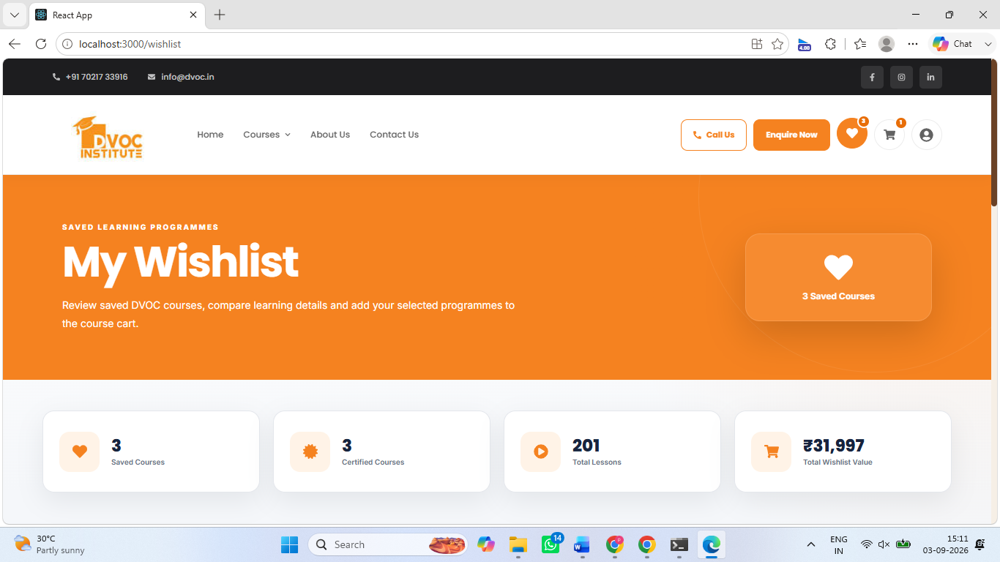</td>
  </tr>
  <tr>
    <td>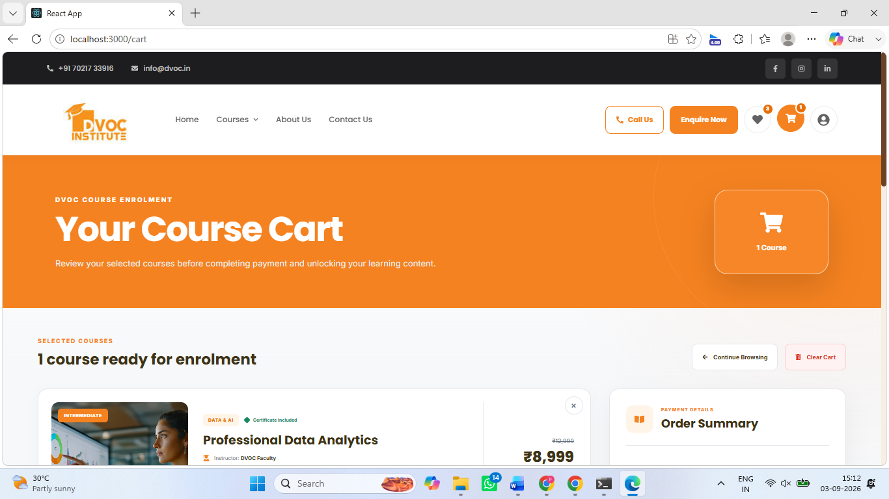</td>
    <td>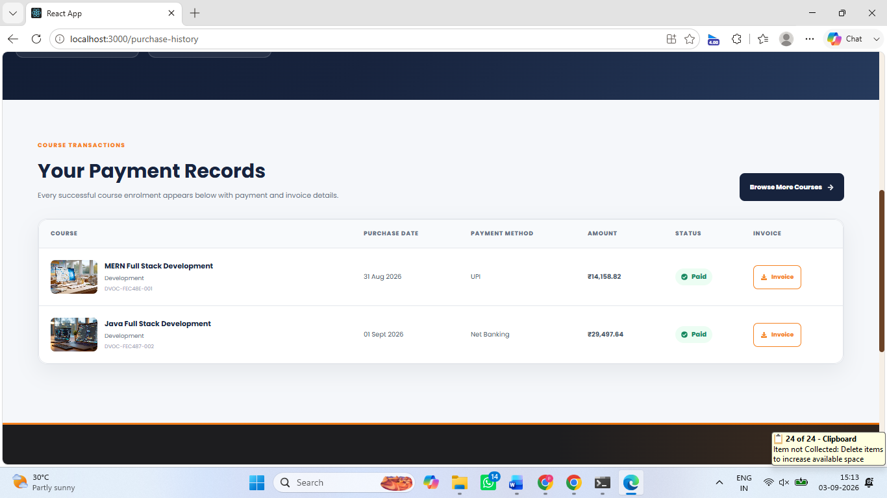</td>
  </tr>
</table>

### 👨‍💼 User Dashboard

<table>
  <tr>
    <td>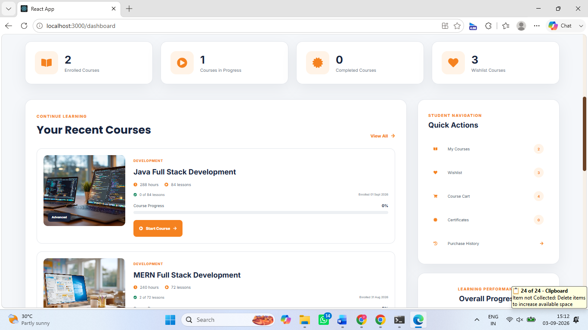</td>
  </tr>
</table>

### 📄 Other Pages

<table>
  <tr>
    <td>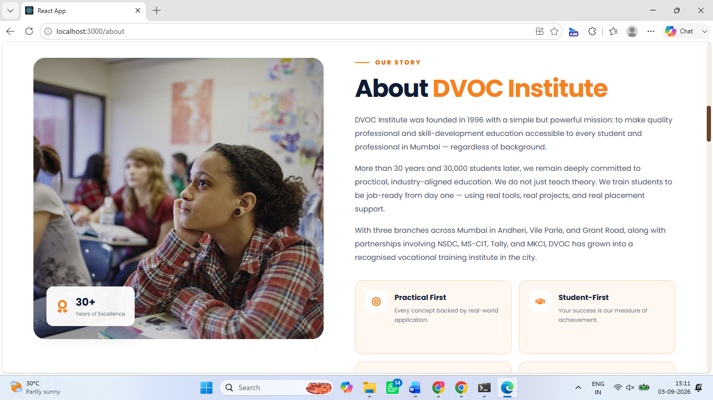</td>
    <td>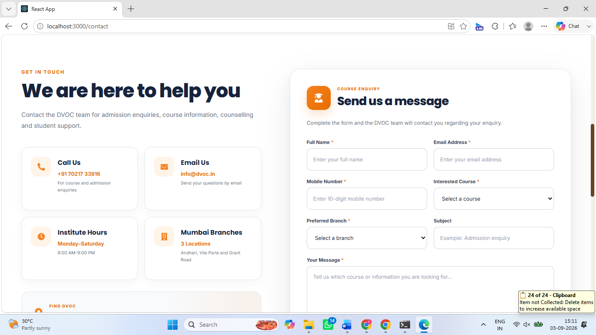</td>
  </tr>
  <tr>
    <td>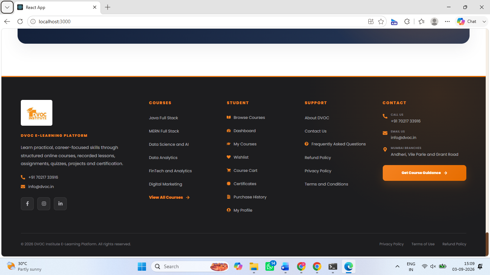</td>
  </tr>
</table>

---

## 📂 Project Structure

```text
e-learning-platform/
│
├── backend/
│   ├── config/
│   ├── controllers/
│   ├── models/
│   ├── routes/
│   ├── utils/
│   ├── server.js
│   └── package.json
│
├── public/
│
├── src/
│   ├── admin/
│   ├── components/
│   ├── pages/
│   ├── assets/
│   ├── config.js
│   ├── App.js
│   └── index.js
│
├── react_project/
│   ├── home.png
│   ├── course.png
│   ├── course1.png
│   ├── my_course.png
│   ├── Profile.png
│   ├── wishlist.png
│   ├── cart.png
│   ├── pay_history.png
│   ├── dashboard.png
│   ├── About.png
│   ├── contact.png
│   └── footer.png
│
├── .gitignore
├── package.json
├── package-lock.json
└── README.md
